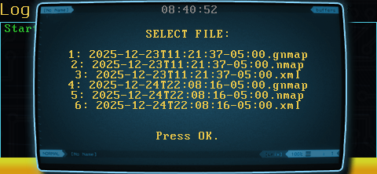
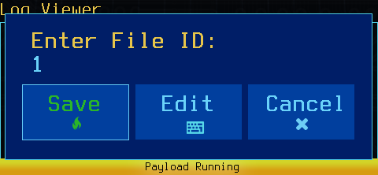
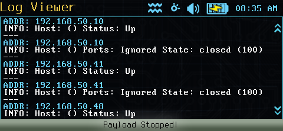

# Log Viewer

**Log Viewer** is a high-performance log analysis tool for the WiFi Pineapple Pager.

---

### Features
* **Turbo Batching:** Renders 50+ lines of log data instantly using compiled buffers.
* **Dual View Modes:** Choose between **Parsed** (Deconstructed Color) or **Raw** (Standard Text).
* **D-Pad Navigation:** Vertical up/down scrolling of log files for easier access.
* **Large File Safety:** Automatically detects massive files and offers to "Tail" (view the last 60 lines) to prevent device freezing.

---

### Workflow Tutorial

**1. Select Loot Folder**
The payload begins by scanning your `/root/loot` directory. It presents a vertical list of all available folders.
* *Note: Press Enter to 'scroll' if the list exceeds the screen size.*


**2. Enter Folder ID**
Input the ID number of the folder you wish to inspect.


**3. Select File**
The tool lists all compatible files (logs, nmap scans, XMLs) within that folder.



**4. Enter File ID**
Input the ID number of the specific file to view.



**5. Select View Mode**
Choose how you want the data displayed:
* **1. Parsed Log:** Breaks lines into Color-Coded sections (Time/Status/IP).
* **2. Raw Log:** Displays the file exactly as it was saved.


**6. Confirm Selection**
Use the number picker to confirm your mode.


**7. Render Log**
The tool compiles the render script. Press **OK** to generate the view.


**8. Analysis View**
The log is displayed on screen.
* **Yellow:** Timestamp
* **Blue:** IP or MAC Address
* **Green/Red:** Username/Password
* **White:** General Info



---

### Log Format
The tool parses standard text logs found in `/root/loot`. The Deconstruction Engine breaks them down visually. Below is an example of an Nmap scan result:

```text
TIME: 11:21:44
ADDR: 192.168.50.5
INFO: # Nmap 7.95 scan initiated Tue Dec 23 2025
as: nmap -Pn -sS -F -oA
/root/loot/nmapTarget/2025-12-23T11:21:37-05:00
/24
---
ADDR: 192.168.50.1
INFO: Host: () Status: Up
---
